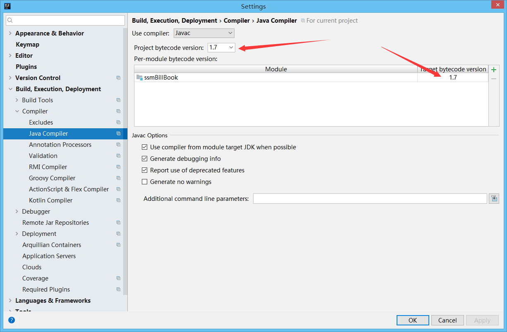
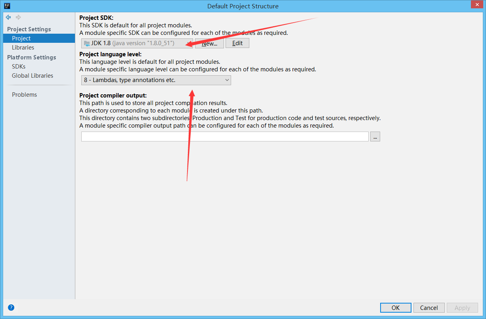
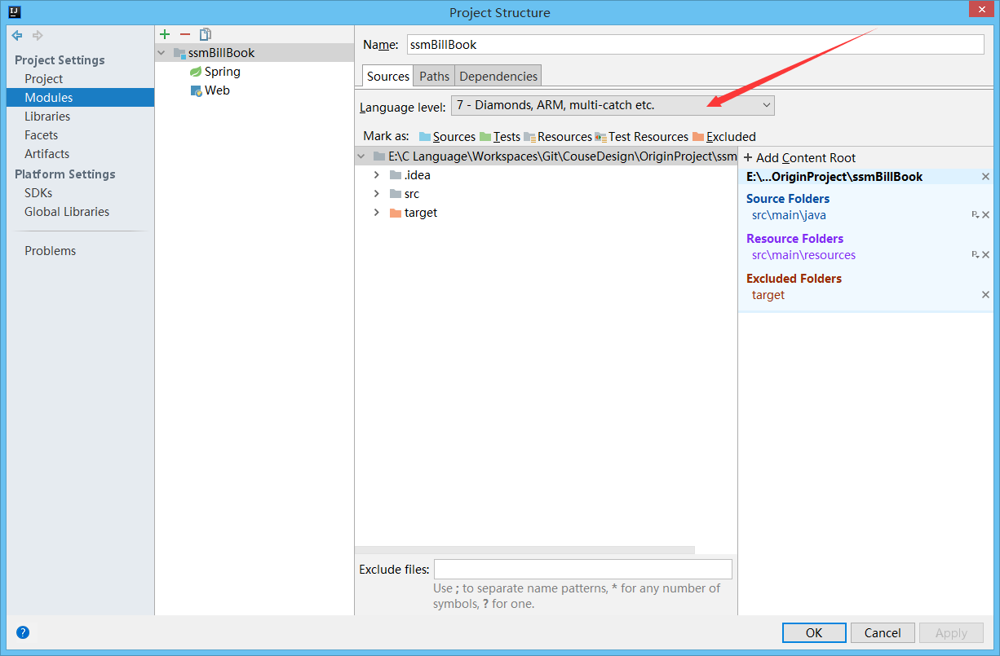

# 简易记账服务端  ssmBillBook 
简易记账本 --- 后端SSM框架搭建的api接口
* App前端项目地址：[https://github.com/Run2948/EasyBill](https://github.com/Run2948/EasyBill)

## 接口介绍
* 请移步：[README_API.md](./docs/README_API.md)

## 开发笔记
* 1.[IDEA编译错误：源值1.5已过时，将在未来所有版本中删除](https://blog.csdn.net/duchao123duchao/article/details/71480106)

* 2.[本地项目关联到远程git仓库的解决方案](https://blog.csdn.net/vi_error/article/details/80608793)